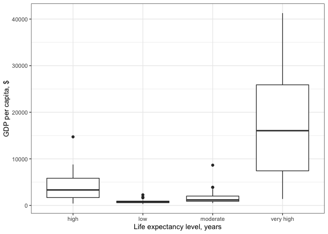
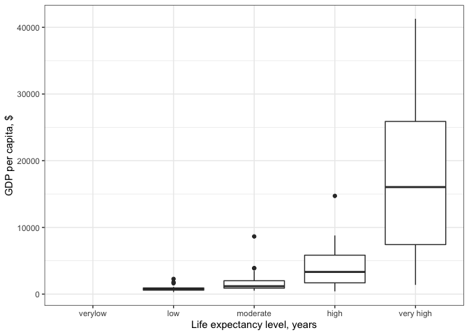
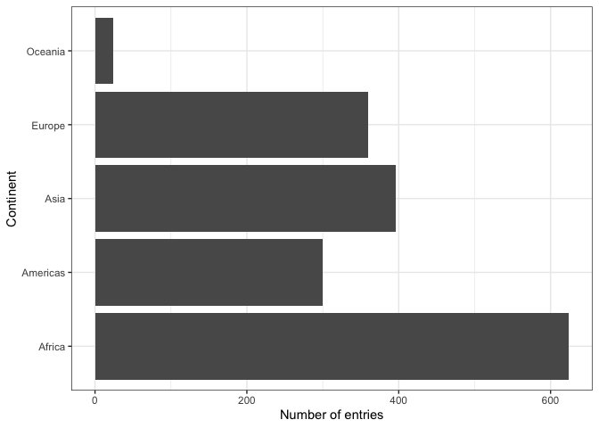
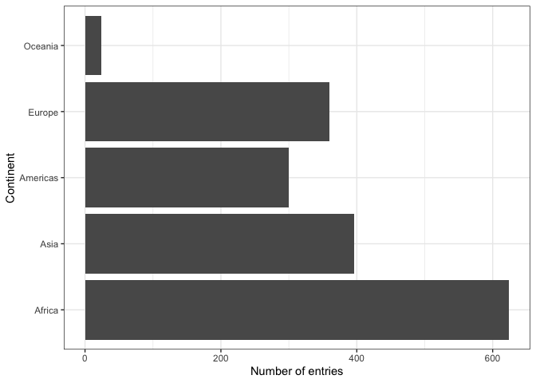
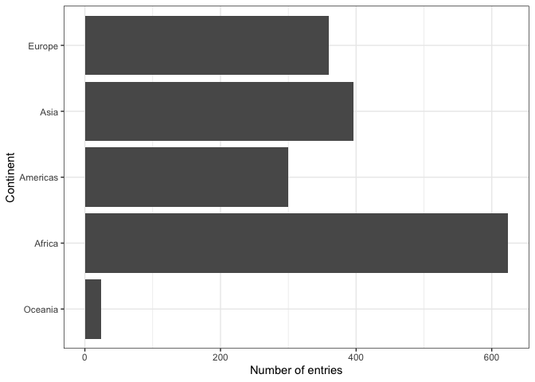

```r
library(gapminder)
library(tidyverse)
```

```
## ── Attaching packages ───────────────────────────────────────────────────────────────────────────────────────────────────── tidyverse 1.2.1 ──
```

```
## ✔ ggplot2 3.2.1          ✔ purrr   0.3.2     
## ✔ tibble  2.1.3          ✔ dplyr   0.8.3     
## ✔ tidyr   1.0.0.9000     ✔ stringr 1.4.0     
## ✔ readr   1.3.1          ✔ forcats 0.4.0
```

```
## Warning: package 'ggplot2' was built under R version 3.5.2
```

```
## Warning: package 'tibble' was built under R version 3.5.2
```

```
## Warning: package 'purrr' was built under R version 3.5.2
```

```
## Warning: package 'dplyr' was built under R version 3.5.2
```

```
## Warning: package 'stringr' was built under R version 3.5.2
```

```
## Warning: package 'forcats' was built under R version 3.5.2
```

```
## ── Conflicts ──────────────────────────────────────────────────────────────────────────────────────────────────────── tidyverse_conflicts() ──
## ✖ dplyr::filter() masks stats::filter()
## ✖ dplyr::lag()    masks stats::lag()
```

```r
library(dplyr)
library(forcats)
library(ggplot2)
library(plotly)
```

```
## 
## Attaching package: 'plotly'
```

```
## The following object is masked from 'package:ggplot2':
## 
##     last_plot
```

```
## The following object is masked from 'package:stats':
## 
##     filter
```

```
## The following object is masked from 'package:graphics':
## 
##     layout
```

## Motivating the need for factors in R
factors allows you to sort data by value , or allows alphabetical order
factor -when you 
can sort by mean, etcs

otehrwise would have to wrangle, manually specifiy, rearrange data frame, and manualy specifu
### Activity 1: Using Factors for plotting 

**1.1** Let's look again into `gapminder` dataset and create a new cloumn, `life_level`, that contains five categories ("very high", "high","moderate", "low" and "very low") based on life expectancy in 1997. Assign categories accoring to the table below:

| Criteria | life_level| 
|-------------|-----------|
| less than 23 | very low |
| between 23 and 48 | low |
| between 48 and 59 | moderate |
| between 59 and 70 | high |
| more than 70 | very high |

Function `case_when()` is a tidier way to vectorise multiple `if_else()` statements. you can read more about this function [here](https://dplyr.tidyverse.org/reference/case_when.html).


```r
gapminder %>% 
  filter(year == 1997) %>% 
  mutate(life_level = case_when(lifeExp < 23 ~ "very low",
                                lifeExp < 48 ~ "low",
                                lifeExp < 59 ~ "moderate",
                                lifeExp < 70 ~ "high",
                                TRUE ~ "very high")) %>% 
  ggplot() + geom_boxplot(aes(x = life_level, y = gdpPercap)) +
  labs(y = "GDP per capita, $", x= "Life expectancy level, years") +
  theme_bw() 
```

<!-- -->

Do you notice anything odd/wrong about the graph?

We can make a few observations:

- It seems that none of the countries had a "very low" life-expectancy in 1997. 

- However, since it was an option in our analysis it should be included in our plot. Right?

- Notice also how levels on x-axis are placed in the "wrong" order.it is alphabetical.

**1.2** You can correct these issues by explicitly setting the levels parameter in the call to `factor()`. Use, `drop = FALSE` to tell the plot not to drop unused levels 
discrete because factors and drop=False
usually dropping very low, because it doent see it in data set, so then you think.

```r
gapminder %>% 
  filter(year == 1997) %>% 
  mutate(life_level = factor(case_when(lifeExp < 23 ~ "very low",
                                lifeExp < 48 ~ "low",
                                lifeExp < 59 ~ "moderate",
                                lifeExp < 70 ~ "high",
                                TRUE ~ "very high"),
                              levels=c("verylow", "low", "moderate", "high", "very high")))  %>% 
  ggplot() + geom_boxplot(aes(x = life_level, y = gdpPercap)) +
  labs(y = "GDP per capita, $", x= "Life expectancy level, years") +
    scale_x_discrete(drop=FALSE) + 
  theme_bw() 
```

<!-- -->

## Inspecting factors (activity 2)

In Activity 1, we created our own factors, so now let's explore what categorical variables that we have in the `gapminder` dataset.

### Exploring `gapminder$continent` (activity 2.1)

Use functions such as `str()`, `levels()`, `nlevels()` and `class()` to answer the following questions:

- what class is  `continent`(a factor or charecter)?
- How many levels? What are they?
- What integer is used to represent factor "Asia"?
sepcify column continent$


```r
gapminder$continent %>% 
  class()
#tells you it is a factor
gapminder$continent %>% 
  levels()
#tosee all to factors, dont use string cant see it all
it is third in list so asia is 3

or use string

gapminder$continent %>% 
  str()
#dont fully get that

```

```
## Error: <text>:7:4: unexpected symbol
## 6: #tosee all to factors, dont use string cant see it all
## 7: it is
##       ^
```

### Exploring `gapminder$country` (activity 2.2)

Let's explore what else we can do with factors:

Answer the following questions: 

- How many levels are there in `country`?
- Filter `gapminder` dataset by 5 countries of your choice. How many levels are in your filtered dataset?


```r
gapminder$country%>%
  nlevels
```

```
## [1] 142
```

```r
#142

#filter, five fountries of choics
h_countries=c("Egypt", "Haiti", "Romania", "Thainland", "Venezuela")
  gap=gapminder%>% filter (country %in% h_countries)
  
  gap$country %>%
    nlevels()
```

```
## [1] 142
```

## Dropping unused levels

What if we want to get rid of some levels that are "unused" - how do we do that? 

The function `droplevels()` operates on all the factors in a data frame or on a single factor. The function `forcats::fct_drop()` operates on a factor.


```r
h_gap_dropped <- gapminder %>% 
  droplevels()

h_gap_dropped$country %>%
  nlevels()
```

```
## [1] 142
```

## Changing the order of levels

Let's say we wanted to re-order the levels of a factor using a new metric - say, count().

We should first produce a frequency table as a tibble using `dplyr::count()`:


```r
gapminder %>% count(continent)
```

```
## # A tibble: 5 x 2
##   continent     n
##   <fct>     <int>
## 1 Africa      624
## 2 Americas    300
## 3 Asia        396
## 4 Europe      360
## 5 Oceania      24
```

The table is nice, but it would be better to visualize the data.
Factors are most useful/helpful when plotting data.
So let's first plot this:
bar is doing samething as count function just used for graph
geom bar only specity one x acis

fct_reverse. - you can use that to reverse.


```r
gapminder %>%
  ggplot() +
  geom_bar(aes(continent)) + 
  coord_flip() +
  theme_bw() +
  ylab("Number of entries") + xlab("Continent")
```

<!-- -->

```r
gapminder %>%
  ggplot() +
  geom_bar(aes(fct_infreq(continent))) + 
  coord_flip() +
  theme_bw() +
  ylab("Number of entries") + xlab("Continent")
```

<!-- -->

Think about how levels are normally ordered. 
It turns out that by default, R always sorts levels in alphabetical order. 
However, it is preferable to order the levels according to some principle:

  1. Frequency/count. 
  
- Make the most common level the first and so on. Function `fct_infreq()` might be useful.
- The function `fct_rev()` will sort them in the opposite order.

For instance ,
   mased on median life exp `  

```r
#default summarizing function is medianr
gapminder %>%
  ggplot() +
  geom_bar(aes(fct_reorder(continent,lifeExp))) +
  coord_flip()+
  theme_bw() +
  ylab("Number of entries") + xlab("Continent")
```

<!-- -->

```r
gapminder %>%
  ggplot() +
  geom_bar(aes(fct_reorder(continent,lifeExp,max))) +
  coord_flip()+
  theme_bw() +
  ylab("Number of entries") + xlab("Continent")
```

<!-- -->

```r
#it sorts by max.
```

Section 9.6 of Jenny Bryan's [notes](https://stat545.com/factors-boss.html#reorder-factors) has some helpful examples.

  2. Another variable. 
  
  - For example, if we wanted to bring back our example of ordering `gapminder` countries by life expectancy, we can visualize the results using `fct_reorder()`. 


```r
##  default summarizing function is median()
gapminder %>%
  ggplot() +
  geom_bar(aes(FILL_IN_THIS)) +
  coord_flip()+
  theme_bw() +
  xlab("Continent") + ylab("Number of entries") 
```

```
## Error in FUN(X[[i]], ...): object 'FILL_IN_THIS' not found
```

<!-- -->

Use `fct_reorder2()` when you have a line chart of a quantitative x against another quantitative y and your factor provides the color. 


```r
## order by life expectancy 
ggplot(h_gap, aes(x = year, y = lifeExp,
                  color = FILL_IN_THIS)) +
  geom_line() +
  labs(color = "country")
```

```
## Error in ggplot(h_gap, aes(x = year, y = lifeExp, color = FILL_IN_THIS)): object 'h_gap' not found
```

## Change order of the levels manually

This might be useful if you are preparing a report for say, the state of affairs in oceania.


```r
gapminder %>%
  ggplot() +
  geom_bar(aes(fct_relevel(continent,"Oceania"))) +
  coord_flip()+
  theme_bw() +
  ylab("Number of entries") + xlab("Continent")
```

<!-- -->

```r
gapminder %>%
  ggplot() +
  geom_bar(aes(fct_relevel(continent,"Oceania","Europe"))) +
  coord_flip()+
  theme_bw() +
  ylab("Number of entries") + xlab("Continent")
```

<!-- -->
More details on reordering factor levels by hand can be found [here] https://forcats.tidyverse.org/reference/fct_relevel.html

### Recoding factors

Sometimes you want to specify what the levels of a factor should be.
For instance, if you had levels called "blk" and "brwn", you would rather they be called "Black" and "Brown" - this is called recoding.
Lets recode `Oceania` and the `Americas` in the graph above as abbreviations `OCN` and `AME` respectively using the function `fct_recode()`.


```r
gapminder %>%
  ggplot() +
  geom_bar(aes(fct_recode(continent,"OCN"=Oceania", "EUR"=Europe"))) +
  coord_flip()+
  theme_bw() +
  ylab("Number of entries") + xlab("Continent")

you could relevel and then do recode

gapminder %>% fct_relevel()

```

```
## Error: <text>:3:50: unexpected string constant
## 2:   ggplot() +
## 3:   geom_bar(aes(fct_recode(continent,"OCN"=Oceania", "
##                                                     ^
```

## Grow a factor (OPTIONAL)

Let’s create two data frames,`df1` and `df2` each with data from two countries, dropping unused factor levels.


The country factors in df1 and df2 have different levels.
Can we just combine them?


The country factors in `df1` and `df2` have different levels.
Can you just combine them using `c()`?


Explore how different forms of row binding work behave here, in terms of the country variable in the result.

